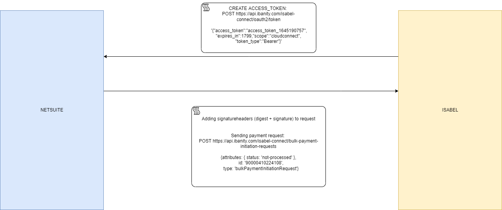

# Connecting to the Belgian Banking interface in NodeJS

For this blogpost I would like to try something different. No Java on my mind, but a proof of concept in NodeJS that I'm working.  

A lot if not all Belgian based companies use the multibanking service Isabel which provides access to 26 Belgian banks. Developers get asked to automate the connections and deliveries to the banks via the Isabel service, which can be a challenge at times. Luckily, the developmentteam at the Isabelgroup provides a lot of usefull libraries to help the integrationprocess. Unfortunately javascript is not part of the repositories and since I need a custom solution, I created this proof of concept. 

As far as this article goes, I will only discuss the connection with and posting PAIN-files in the Isabel interface. But the main idea as to getting an accesstoken and posting some information is a widely used process for API's. The following scheme gives a visual interpretation on how the calls actually work. 

